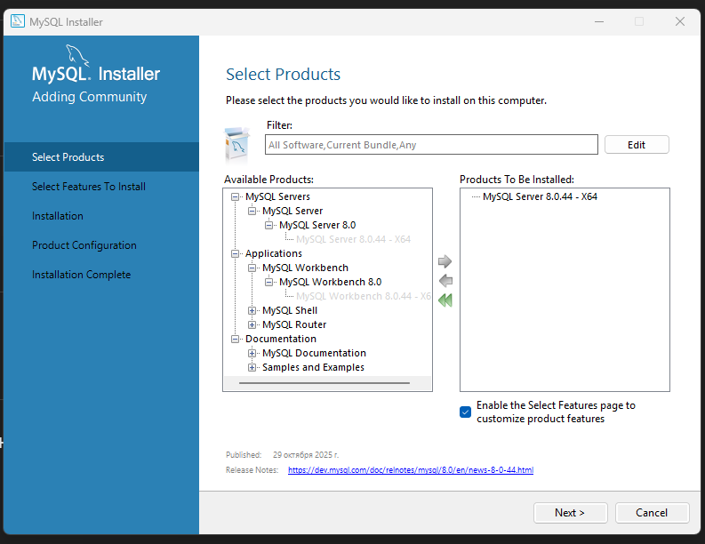
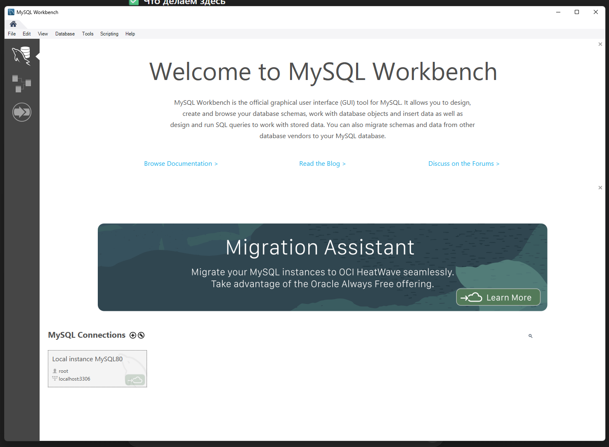
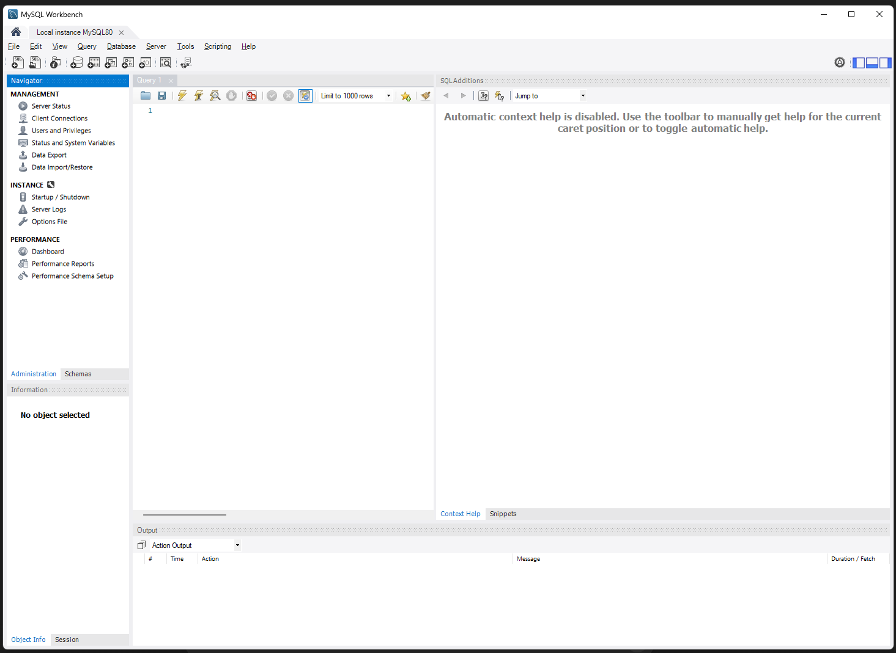
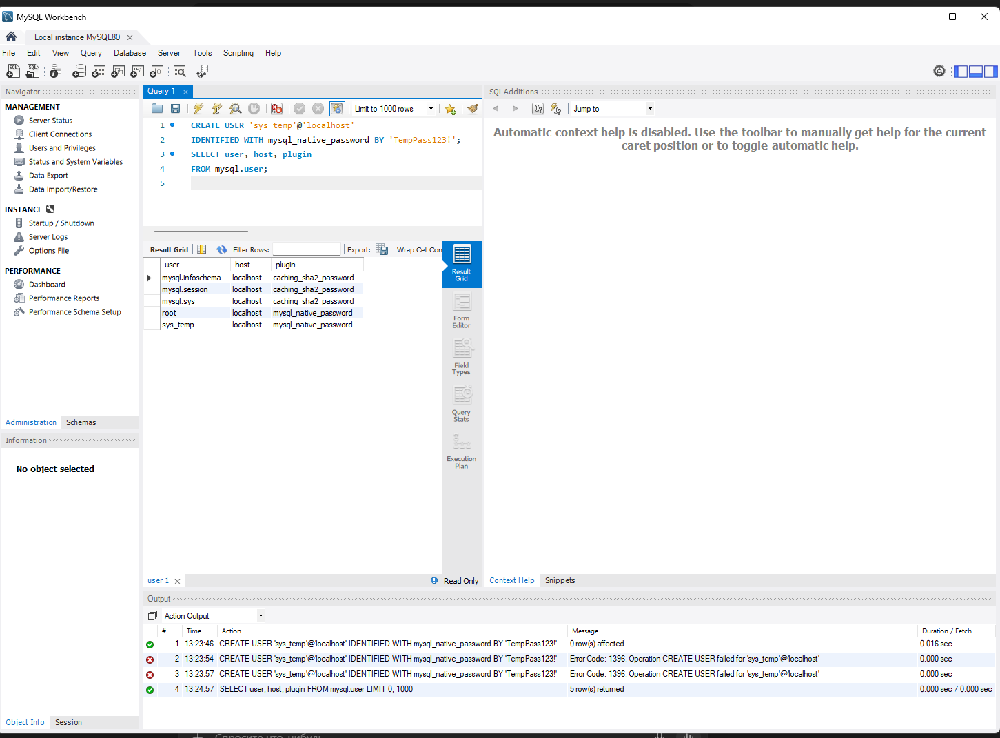
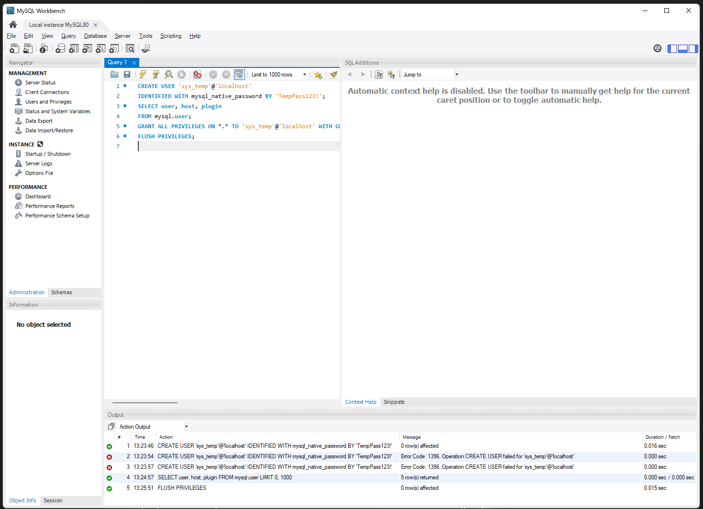
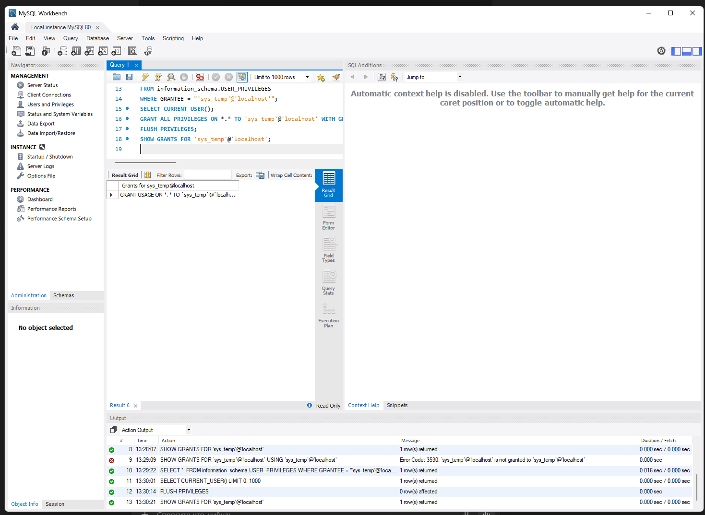
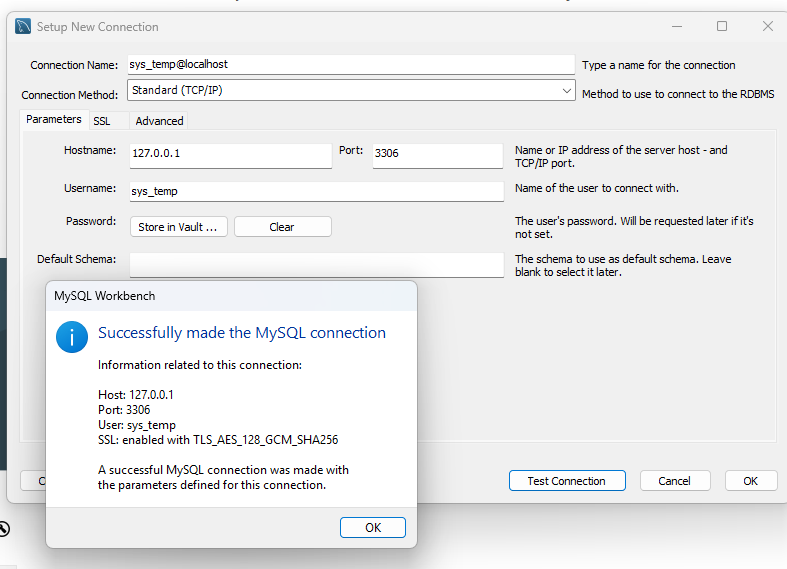
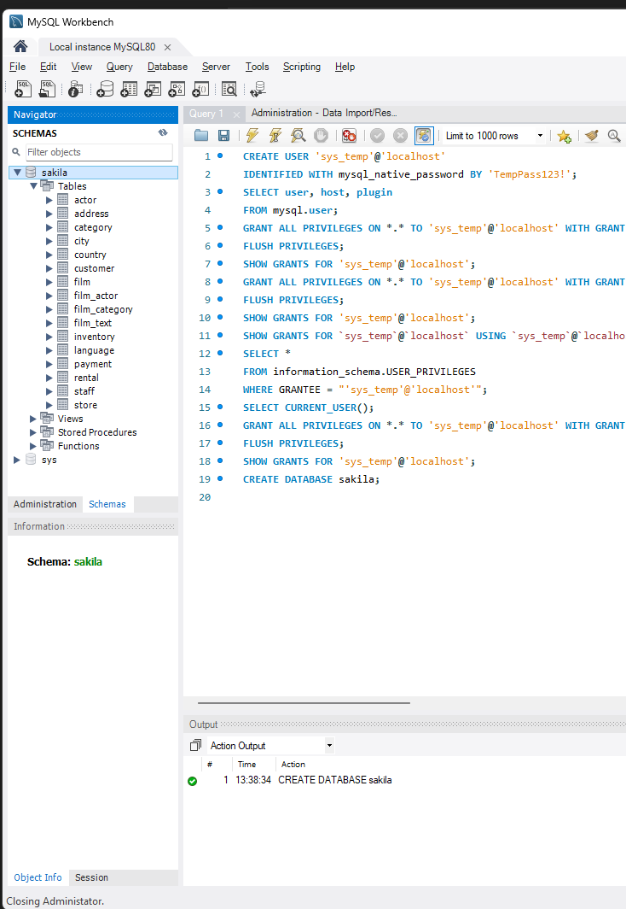
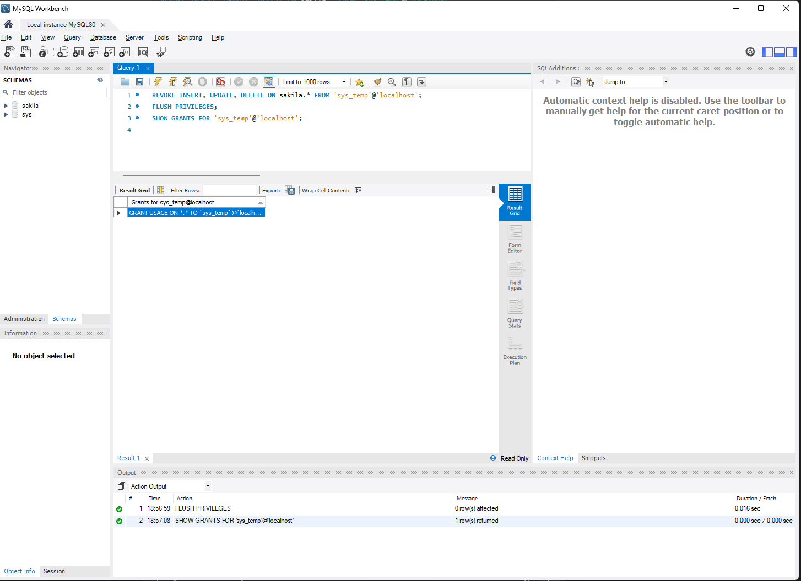

# Домашнее задание по MySQL  
**Гаран Степан**

## Тема: Установка MySQL, создание пользователя, импорт базы данных Sakila

---

## Задание 1. Установка MySQL Server и Workbench

1. Запускаю инсталлятор MySQL Installer.  
2. Выбираю установку MySQL Server и MySQL Workbench.  
3. Прохожу стандартные шаги установки.

**Скриншот установки:**


---

## Задание 2. Подготовка MySQL Workbench

Открываю MySQL Workbench — начальное окно пустое.

**Скриншот пустого окна Workbench:**




## Задание 3. Попытка создать пользователя `sys_temp`

Ввожу команду:

```sql
CREATE USER 'sys_temp'@'localhost'
IDENTIFIED WITH mysql_native_password BY 'TempPass123!';
```
Скриншот попытки создания:


---
## Задание 4. Просмотр списка пользователей

Использую команду:

```sql
SELECT user, host, plugin
FROM mysql.user;
```

Пользователи отображаются корректно.

**Скриншот списка пользователей:**  



## Задание 5. Назначение привилегий пользователю
---
Выдаю пользователю `sys_temp` максимальные привилегии:

```sql
GRANT ALL PRIVILEGES ON *.* TO 'sys_temp'@'localhost' WITH GRANT OPTION;
FLUSH PRIVILEGES;
```

**Скриншот назначения привилегий:** 



---
## Задание 6. Проверка назначенных привилегий

Проверяю, какие привилегии назначены пользователю `sys_temp`:

```sql
SHOW GRANTS FOR 'sys_temp'@'localhost';
```

**Скриншот результата проверки привилегий:**



---
## Задание 7. Подключение под новым пользователем

Подключаюсь к серверу MySQL под пользователем `sys_temp`:

1. Открываю MySQL Workbench.  
2. Создаю новое подключение, указываю:  
   - **User:** `sys_temp`  
   - **Password:** `TempPass123!`  
3. Тестирую соединение — подключение успешно.

**Скриншот успешного подключения:**  



---
## Задание 8. Импорт учебной базы данных Sakila

Импортирую учебную базу `Sakila` через MySQL Workbench:

1. Открываю вкладку **Server → Data Import**.  
2. Выбираю **Import from Self-Contained File**.  
3. Указываю файлы:  
   - `sakila-schema.sql`  
   - `sakila-data.sql`  
4. Запускаю импорт.  
5. После выполнения обновляю список схем — база появилась.

**Скриншот структуры импортированной базы Sakila:**  


---

## Задание 2. Таблица «Название таблицы — первичный ключ»

| Название таблицы | Первичный ключ       |
|------------------|----------------------|
| actor            | actor_id             |
| address          | address_id           |
| category         | category_id          |
| city             | city_id              |
| country          | country_id           |
| customer         | customer_id          |
| film             | film_id              |
| film_actor       | actor_id, film_id    |
| film_category    | film_id, category_id |
| film_text        | film_id              |
| inventory        | inventory_id         |
| language         | language_id          |
| payment          | payment_id           |
| rental           | rental_id            |
| staff            | staff_id             |
| store            | store_id             |

---

## Задание 3*. Ограничение прав пользователя `sys_temp` на базу `sakila`

Убираю у пользователя `sys_temp` права на внесение, изменение и удаление данных в базе `sakila`:

```sql
REVOKE INSERT, UPDATE, DELETE ON sakila.* FROM 'sys_temp'@'localhost';
FLUSH PRIVILEGES;
```

